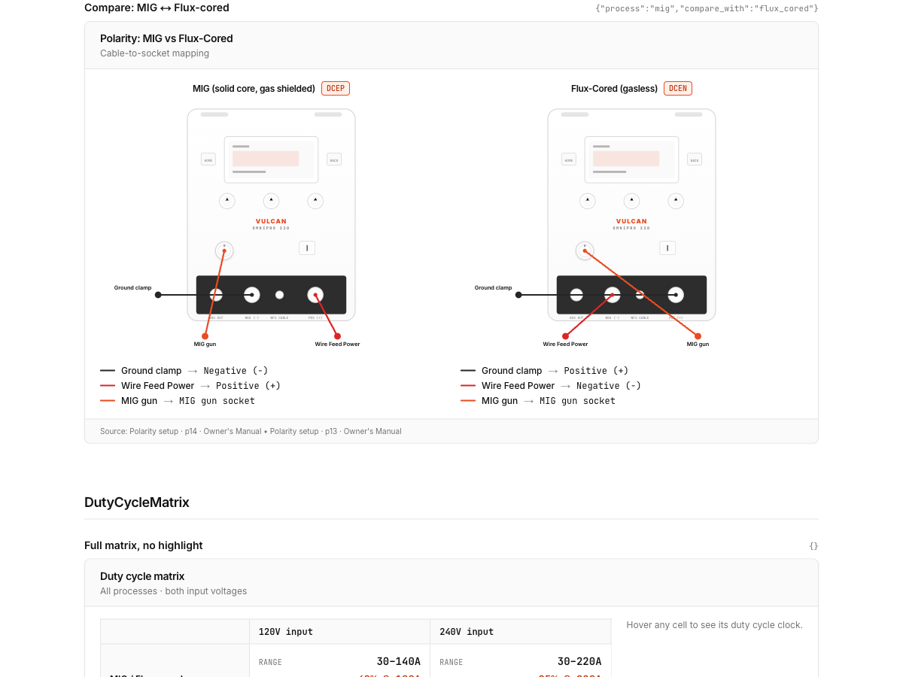
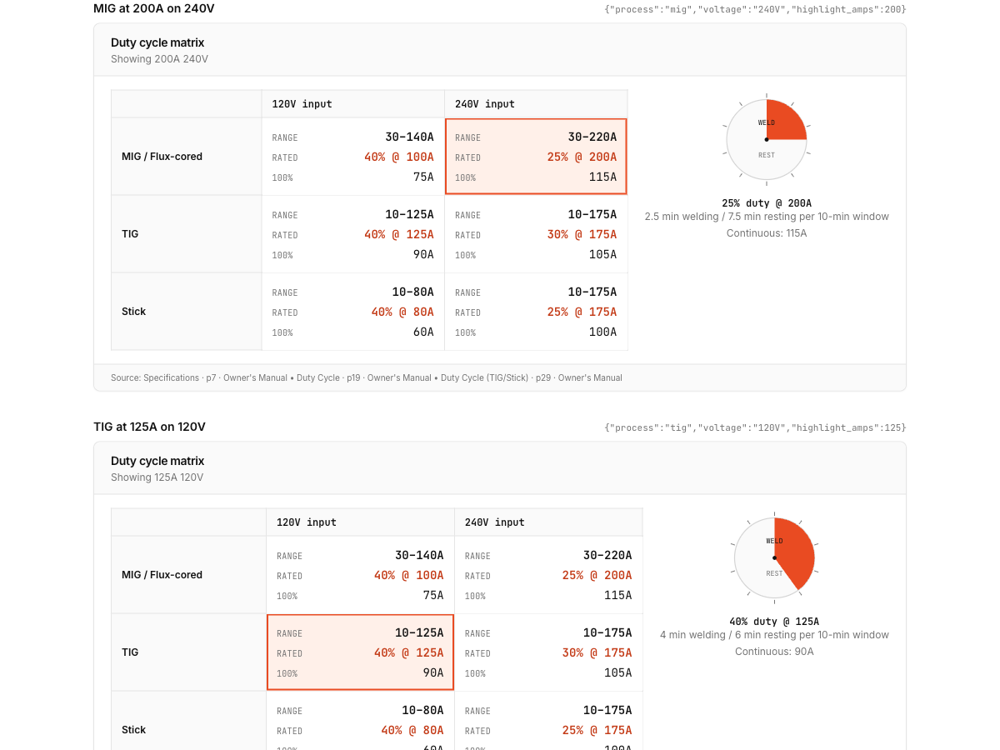

# Prox Challenge · Vulcan OmniPro 220 agent

A multimodal technical expert for Harbor Freight's **Vulcan OmniPro 220** multiprocess welder. Built on the Anthropic SDK with tool use. Answers with diagrams, matrices, and interactive artifacts instead of prose.

> 🔗 **Live demo:** https://prox-challenge-delta.vercel.app — ask anything about the welder, or click a suggested question. No account, no login.

<p align="center">
  
  <br/>
  <em>Ask "I'm switching from MIG to flux-cored — what changes?" and the agent renders both front panels side-by-side, showing the polarity flip.</em>
</p>

---

## Try it locally (under 2 minutes)

```bash
git clone https://github.com/KJ-11/prox-challenge.git
cd prox-challenge
cp .env.example .env          # paste your ANTHROPIC_API_KEY
npm install
npm run dev                   # http://localhost:3000
```

Three commands after clone. **Everything is pre-built**: the knowledge corpus, the 93-figure catalog, the 9 structured tables, and all 51 page PNGs ship in the repo. You do not need to run `npm run extract`.

Minimum requirement: an Anthropic API key with access to `claude-opus-4-7`. The project uses one key, pinned to one model.

---

## What it does

Drop a question into the input or click a suggested prompt. The agent:

1. Reads the question (and any uploaded image via Claude vision)
2. Decides the right answer form: a pre-built interactive artifact, a prose response, or a clarification chip
3. Streams text back while rendering artifacts inline
4. Cites the relevant manual pages in the sidebar

Five signature flows:

| Question | What you see |
|---|---|
| "What's the duty cycle for MIG at 200A on 240V?" | A 3×2 process-×-voltage matrix with the MIG/240V cell highlighted and an animated welding/resting clock beside it |
| "I'm switching from MIG to flux-cored — what changes?" | Two stylized front panels side-by-side with cables color-coded; the polarity flip is immediately visible |
| "What settings for 1/8" mild steel MIG?" | An LCD-styled configurator with dropdowns; voltage/WFS/gas/SCFH recompute as you change material or thickness |
| "Getting porosity in my flux-cored welds — help" | A collapsible decision tree filtered to flux-cored-specific causes (polarity, CTWD, contamination) with linked figures |
| Upload a weld photo + "diagnose this" | Side-by-side comparison of your photo vs. the manual's closest labeled reference, with the fix checklist below |

Plus three more templates (component highlight, procedural walkthrough, interactive selection chart) for ~8 total.

---

## Design decisions

A few non-obvious choices worth flagging:

**Visual-first, not prose-first.** The system prompt's single load-bearing rule: if an answer involves a diagram, matrix, or procedure, the agent calls `render_artifact` — prose describing a diagram is explicitly a failure mode. This is enforced with a few-shot "wrong vs right" example in the system prompt.

**Claude-as-retriever, not embeddings.** The full knowledge catalog (~130 items: chunk breadcrumbs, figure captions, structured-table schemas, all 35 weld diagnosis entries) lives in the cached system prompt. The agent picks IDs directly via `load_chunks` / `load_figures` / `lookup_structured`. No vector DB. For this corpus size, Claude's reasoning beats cosine similarity and keeps the whole pipeline to one API key. Cached tokens (~32k) are read at ~90% hit rate after the first turn in a session.

**Pre-built artifact templates, not generative.** Eight React components with typed params, not on-the-fly HTML generation. Reliable to render, themable for dark mode, fast. The generative fallback is tracked in `TODO.md` if we return to it.

**Knowledge pre-built and committed.** All PDF extraction happens once offline. The repo ships `knowledge/corpus.json`, `knowledge/figures/catalog.json`, `knowledge/structured/*.json`, and every page PNG. Evaluators never wait on extraction.

**The agent sees images directly.** No separate "diagnose_weld_photo" tool — Claude vision already handles user-uploaded images, and the system prompt instructs it to match against the in-catalog weld diagnosis entries and emit a `weld_comparison` artifact. The client auto-injects the user's blob URL.

**Single API key, single model, single config file.** Everything configurable lives in `.env.example`. Model pinned to `claude-opus-4-7` — never a moving alias.

More background on the design process in `lib/` and `PLAN.md`.

---

## Architecture

```
knowledge/               ← pre-built, committed to repo
├── corpus.json             84 prose chunks with breadcrumbs
├── figures/catalog.json    93 figures with captions + depicts tags
├── pages/                  51 full-page PNGs (owner manual, quick start, selection chart)
└── structured/             9 JSON tables — duty_cycle, specs, polarity, wire_compatibility,
                            selection_chart, troubleshooting, weld_diagnosis, parts_list,
                            safety_symbols

lib/
├── agent/
│   ├── model.ts            pinned model id + lazy Anthropic client
│   ├── tools.ts            5 tool schemas → Anthropic tool_use shape
│   ├── tool-handlers.ts    load_chunks, load_figures, lookup_structured,
│   │                       render_artifact, ask_clarification
│   ├── catalog.ts          renders the cached knowledge catalog into the system prompt
│   ├── system-prompt.ts    framing + principles + few-shot + catalog (cache_control)
│   ├── loop.ts             runAgent() generator — wraps beta.messages.toolRunner()
│   ├── events.ts           ServerEvent union + SSE encoder
│   └── ...
├── artifacts/              8 React templates + registry + shared data + source-page map
├── chat/                   useChat hook, SSE reader, types
└── knowledge/              loader + Zod schemas

app/
├── api/chat/route.ts       Node-runtime streaming POST endpoint
├── api/knowledge/[...]/    serves knowledge/pages/*.png for figures in the UI
├── components/             ChatApp, Header, HomeScreen, MessageList, ChatInput,
│                           AssistantMessage, UserBubble, SourcesSidebar, ArtifactRender
├── dev/artifacts/          visual regression playground (seeded variants of each template)
└── page.tsx                mounts ChatApp

scripts/
├── extract_knowledge.ts    one-time PDF → knowledge/ pipeline (already run)
├── run_evals.ts            evaluator: runs questions.yaml and writes results.md
└── check-api.ts            haiku + opus ping for diagnosing key/billing issues

evals/
├── questions.yaml          28 annotated test cases
└── results.md              latest run's output
```

---

## Knowledge pipeline

`npm run extract` (already run, output committed). The pipeline is one Node script:

1. Render every page of all three PDFs (owner's manual 48pp, quick start 2pp, selection chart 1pp) to 150-DPI PNGs via `pdf-to-png-converter` → `knowledge/pages/`
2. Nine targeted extraction passes via Claude Opus vision + tool-forced structured output (each with a Zod schema and page-range prompt) → `knowledge/structured/*.json`. Each call validates server-side and writes atomically with per-pass caching (`knowledge/.cache/`, gitignored) so a crash resumes cleanly.
3. Three corpus passes covering the owner's manual in thirds → `knowledge/corpus.json`: 84 section-level chunks with breadcrumbs, page refs, and related-table links.
4. Three figure passes (owner manual, quick start, selection chart) → `knowledge/figures/catalog.json`: 93 entries with captions, depicts tags, and resolvable `page_image_ref`s.

Every structured JSON was hand-verified against the manual. Every `page_image_ref` in the figure catalog and weld-diagnosis catalog resolves to an existing PNG (verified by `npm run eval`).

---

## Agent loop

```
user message (+ optional image)
  ↓
Claude turn 1 — sees cached system prompt + catalog
  → picks tools in parallel:
     load_chunks / load_figures / lookup_structured / render_artifact / ask_clarification
  ↓
tool results (text, image blocks, JSON)
  ↓
Claude turn 2 — composes answer
  → render_artifact for visual outputs; inline [artifact:<id>] references in prose
  → page-citation chips inlined
  ↓
SSE stream to the client:
  text_delta · tool_call_start · tool_call_args_delta · tool_call_result
  artifact · clarification · usage · done
```

Implementation: `lib/agent/loop.ts` wraps `client.beta.messages.toolRunner` with `stream: true` for automatic multi-turn tool orchestration. `max_iterations: 8`.

### Tool surface (5 tools)

| Tool | Purpose |
|---|---|
| `load_chunks(ids[])` | Batch-load prose chunks by ID from the catalog |
| `load_figures(ids[])` | Batch-load manual figures as image content blocks Claude can see |
| `lookup_structured(table, filters?)` | Query one of the 9 structured tables with shallow filters |
| `render_artifact(type, params)` | Emit a visual artifact for the UI |
| `ask_clarification(question, options[])` | Structured multi-choice follow-up (clickable chips) |

No dedicated "search" tool and no dedicated weld-photo tool. The agent picks IDs from the cached catalog, and uses its native vision on uploaded images directly.

### System prompt

Two blocks:
1. **Framing** (~1.5k tokens, uncached) — role, rendering principle, decision checklist, clarification policy, citation rule, safety rule, tone, weld-photo guidance, few-shot examples.
2. **Catalog** (~5-6k tokens, `cache_control: ephemeral`) — every chunk ID, figure ID, structured-table description + filter keys, weld diagnosis entry. Enforces "never invent IDs."

Cache hit rate on the second turn within a session: ~90%+ (verified in evals).

---

## Artifact system

Eight pre-built React templates in `lib/artifacts/`. Every artifact:

- Has a Zod params schema — the registry validates before rendering
- Composes the shared `ArtifactCard` shell (title / subtitle / badge / body / page-attribution footer)
- Themes via semantic CSS tokens (dark mode works automatically)
- Links every data-point back to an owner's-manual page

| Template | Typical params | Headline feature |
|---|---|---|
| `polarity_diagram` | `{process, highlight?, compare_with?}` | SVG front panel with color-coded cables; `compare_with` renders side-by-side |
| `duty_cycle_matrix` | `{process?, voltage?, highlight_amps?}` | 3×2 matrix, highlighted cell, animated welding/resting clock |
| `settings_configurator` | `{process, material, thickness, wire_size?}` | LCD-styled widget; values recompute live as dropdowns change |
| `troubleshooting_tree` | `{symptom, process}` | Decision tree pulled from structured troubleshooting table, ordered by likelihood |
| `weld_comparison` | `{catalog_id, runner_up_id?}` | User photo ↔ labeled manual reference + fix checklist + collapsible runner-up |
| `procedural_walkthrough` | `{topic}` | Step carousel across 9 common procedures (cable setup per process, spool loading, tungsten sharpen, nozzle clean, feed tension) |
| `component_highlight` | `{figure_id, part_name}` | Pulsing ring on the SVG front panel for named parts; falls back to page PNG with label |
| `selection_chart_interactive` | `{prefilled?}` | Filterable door-sticker chart; columns grey out with explicit reasons as filters narrow |

Browse them all at `/dev/artifacts` (hosted: https://prox-challenge-delta.vercel.app/dev/artifacts). Seeded with representative variants for visual regression.

<p align="center">
  
  <br/>
  <em>Duty cycle matrix with the MIG/240V/200A cell highlighted.</em>
</p>

---

## Evaluation

`npm run eval` runs the full suite in `evals/questions.yaml` — 28 hand-annotated questions across:
- The three README example questions
- One per taxonomy category (spec lookup, polarity, settings, troubleshooting, compatibility, procedural, component ID, safety, warning-screen, ambiguous-clarification)
- Four hard cross-references (continuous duty cycle, MIG→flux switchover, flux-cored 0.045 setup, thin gauge choice)
- Two vision-diagnosis cases + one photo-less case (agent should ask)
- Three must-clarify ambiguous prompts
- Four adversarial (gas tank, bypass duty cycle, Miller comparison, Bluetooth hallucination trap)
- Two tone calibration (beginner vs expert vocabulary)

Each question is annotated with expected modality, expected artifact type, expected tools, must-cite pages, and must-mention strings. The runner streams the agent's response, applies auto-checks, and writes a markdown report with per-question detail + summary.

**Current headline numbers** (`evals/results.md`):

- Modality match: **20/20** (100%)
- Artifact type match: **13/13** (100%)
- Tools match: **3/3** (100%)
- Pages cited: **15/15** (100%)
- Must-not-mention violations: **0**
- Hard errors: **0**
- Must-mention: 26/28 (the 2 "misses" are literal-string mismatches where the agent used correct synonyms — WFS vs "wire feed", "won't help" vs "can't")
- Avg TTFT: 1.5s · Avg total: 13.3s

To reproduce: set `ANTHROPIC_API_KEY`, then `npm run eval`. Costs roughly $3-5 per run on Opus.

---

## What's next

Tracked in `TODO.md`. Highlights:

- **Voice** — CUT from this submission. Web Speech API for browser, Twilio SIP for phone. Directly mirrors Prox's "expressive voice AI" product pillar.
- **Generative artifact fallback** (`render_custom_artifact`) — for long-tail questions outside the 8 pre-built templates.
- **Per-entry crops on weld_diagnosis** — tighter photo crops per defect instead of the current full-page display.
- **Shareable conversation URLs** — each conversation addressable by URL.
- **LLM-as-judge evals** — automated grading alongside the current manual-grade flow.

Honest list of limitations and what we'd build with more time.

---

## Credits

Built for the [Prox founding engineer challenge](https://github.com/prox-technologies/prox-challenge).

- Agent foundation: [Anthropic TypeScript SDK](https://github.com/anthropics/anthropic-sdk-typescript) — specifically `beta.messages.toolRunner` for the multi-turn tool-use loop with streaming
- Frontend: Next.js 16 App Router + React 19 + Tailwind CSS 4
- Product docs: Harbor Freight Tools — [Vulcan OmniPro 220 owner's manual](https://www.harborfreight.com/omnipro-220-industrial-multiprocess-welder-with-120240v-input-57812.html), item #57812

Original challenge README preserved at [`README-challenge-original.md`](./README-challenge-original.md).
